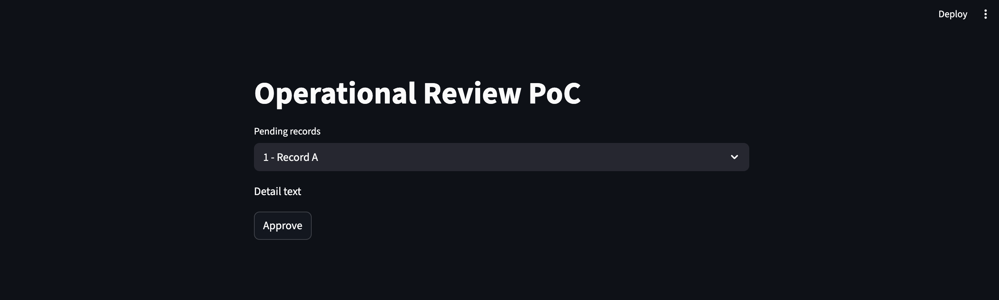
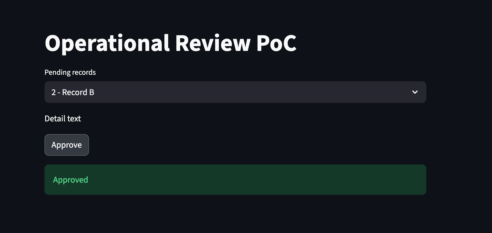

## Streamlit Operational Review PoC

This is a minimal Streamlit prototype demonstrating an
API-driven operational review and approval workflow.

- API-only access (mocked)
- List → detail → approve flow
- Configurable structure

This PoC was built to validate interaction patterns,
not as a production system.


## Setup (Python venv)

```bash
cd streamlit_approval_workflow_poc
python3 -m venv venv
source venv/bin/activate
pip install --upgrade pip
pip install streamlit requests pyyaml
pip freeze > requirements.txt
touch app.py
touch api_mock.py
touch config.yaml
touch README.md
streamlit run app.py
history | tail -n 50
```


## Screenshots
This screen demonstrates a minimal approval workflow:
records are reviewed, approved via API, and immediately removed from the staging list.



