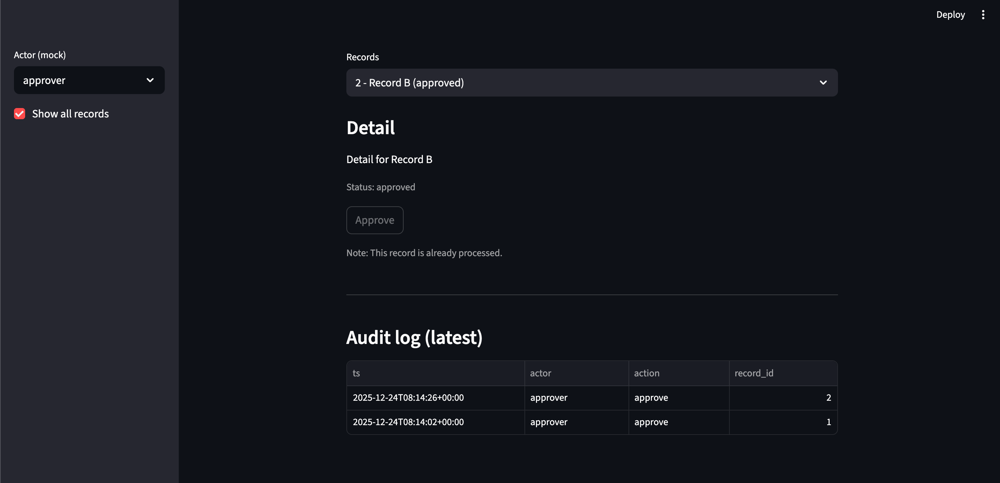

## Streamlit Operational Review PoC

This is a minimal Streamlit prototype demonstrating an
API-driven operational review and approval workflow.

- View pending records
- Approve a record (status changes from `pending` → `approved`)
- Prevent double-approval
- Show an audit log (who approved what, and when)

This PoC uses an in-memory store (no DB) to keep the scope minimal and enable a fast demo.


## Setup (Python venv)

```bash
cd streamlit_approval_workflow_poc
python3 -m venv venv
source venv/bin/activate
pip install --upgrade pip
pip install streamlit requests pyyaml
pip freeze > requirements.txt
touch app.py
touch api_mock.py
touch config.yaml
touch README.md
streamlit run app.py
```


## Screenshots
This screen demonstrates a minimal approval workflow: reviewers select a pending record, approve it via the mock API layer, and the item is removed from the pending list immediately.





## 2-Minute Demo Script (for reviewers)

1. In the sidebar, set Actor (mock) to approver

2. Select a record from Records

3. Click Approve

- Toggle Show all records to ON

4. The approved record is now shown with status approved

6. Confirm Audit log shows a new entry for the approval action

## What This PoC Covers

- Workflow core: approval state transition (pending → approved)

- Guardrails: prevents approval when the record is not pending

- Auditability: records approval events in a simple audit log

- Role intent (mock): approver/requester/admin selector to demonstrate permission intent

## Out of Scope (by design)

- To keep the PoC minimal and fast to review, the following are intentionally excluded:

- Real authentication (OAuth/SSO/passwords)

- Persistent storage (SQLite/Postgres/etc.)

- Reject / return / multi-step approvals

- Concurrency handling / multi-user consistency guarantees

- Automated tests / CI

## Design Notes

State is kept in-memory inside api_mock.py.
Restarting the Streamlit process will reset records and audit events.

The logic is separated into a small API layer (api_mock.py) so persistence
can be replaced later (e.g., JSON or SQLite) without changing the UI structure.

## Project Structure
streamlit-review-poc/
├── app.py
├── api_mock.py
├── requirements.txt
└── README.md

## Next Step (optional)

Replace the in-memory store with JSON or SQLite to persist approvals across restarts.